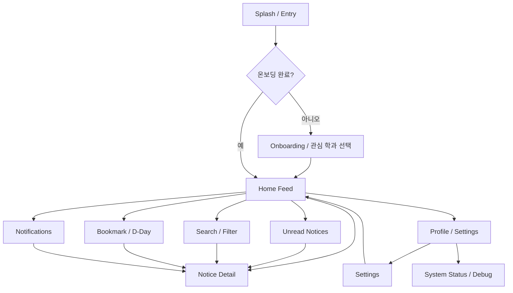

# SRS 앱 데모 활용 설명서

이 문서는 `SRS_Collaboration_Framework_v8_AppBalanced.docx`에 앱 화면과 그림을 넣을 때 사용할 캡처 가이드입니다.

## 1. 실행 준비

PowerShell에서 아래 경로로 이동합니다.

```powershell
cd "C:\Users\dudwl\OneDrive\Desktop\2026_1\소공개\2026s_hw1\skku-notice-demo"
```

처음 실행하거나 `node_modules`가 없으면 설치합니다.

```powershell
npm install
```

웹 데모 실행:

```powershell
npm run web
```

브라우저가 자동으로 열리지 않으면 `http://localhost:8081`을 직접 엽니다. 웹 화면은 데스크톱에서도 모바일 앱처럼 보이도록 중앙의 좁은 프레임 안에 표시됩니다.

Android Emulator 데모:

```powershell
npm run android
```

## 2. 데모 시나리오

발표에서는 아래 순서로 보여주면 SRS의 핵심 요구사항과 자연스럽게 연결됩니다.

1. Splash / Entry 화면에서 앱 이름 확인
2. Onboarding에서 관심 학과와 키워드 선택
3. Home에서 구독 범위 전환, 읽지 않은 공지 배너, 카테고리 칩, 최신순/마감임박순, 저장함, 지난 일정, D-Day 표시 확인
4. 공지 상세로 들어가 읽음 상태, 원문 마감 표현, 정규화 마감일, 분류 신뢰도 확인
5. 즐겨찾기를 누르고 Bookmark / D-Day 화면에서 리마인더 옵션 확인
6. Search에서 키워드, 카테고리, 학과, 읽음, 북마크, 마감 상태 필터 확인
7. Notifications에서 새 공지, 키워드 매칭, 마감 임박, 시스템 알림 확인
8. Profile에서 구독 학과, 키워드 규칙, 알림 토글, System Status 진입 확인
9. System Status에서 목 크롤러 상태와 KoBERT Notice Classifier Mock 상태 확인

## 3. SRS Figure별 추천 자료

| SRS Figure | 넣을 자료 | 앱에서 열 화면 | 캡처 포인트 |
|---|---|---|---|
| Figure 8. Mobile App Navigation Flow | 화면 전환 흐름도 | 이 문서의 Mermaid 다이어그램 또는 직접 그린 흐름도 | Entry, Onboarding, Tabs, Unread, Detail, Settings, System Status 관계 |
| Figure 9. Home Feed App Screenshot | 홈 피드 스크린샷 | `홈` 탭 | 피드 범위 칩, 읽지 않은 공지 배너, 알림 ON/OFF 버튼, 저장함/지난 일정 카드, 카테고리 칩, 최신순/마감임박순, D-Day 배지, 공지 카드 |
| Figure 10. Push Notification Interaction | 알림 상호작용 캡처 | `알림` 탭과 공지 상세 | 키워드 매칭/마감 임박 알림을 누르면 상세 화면으로 이동하는 흐름 |

## 4. Figure 8용 내비게이션 흐름도

아래 Mermaid를 지원하는 도구에서 이미지로 렌더링하거나, 같은 구조로 Google Docs/Figma에서 다시 그리면 됩니다.



SRS 본문에는 이 그림을 `Figure 8. Mobile App Navigation Flow`로 넣으면 됩니다.

## 5. Figure 9 홈 피드 캡처 방법

1. `npm run web` 실행 후 브라우저에서 앱을 엽니다.
2. 온보딩이 나오면 `소융대` 단과대학을 선택한 뒤 `소융대 전체`, `소프트웨어학과`, `인공지능융합전공`, `데이터사이언스융합전공` 중 발표에 보여줄 범위를 선택합니다.
3. 키워드는 `장학금, 삼성전자, 인턴, 졸업`을 유지합니다.
4. 홈 화면에서 `전체` 또는 `취업` 카테고리를 선택합니다.
5. 화면 상단부터 공지 카드 2~3개가 보이도록 캡처합니다.

캡처에 반드시 보이면 좋은 요소:

- 전체 구독 / 단과대 전체 / 학과 단위 피드 범위 칩
- 검색 아이콘
- 클릭 가능한 읽지 않은 공지 개수 배너
- 배너 안의 알림 ON/OFF 버튼
- 저장함 카드와 지난 일정 카드
- 스크롤바 없이 좌우 화살표로 넘기는 가로 필터
- 카테고리 칩
- 최신순 / 마감임박순 정렬
- D-Day 배지
- 카테고리 배지
- 즐겨찾기 아이콘
- 읽음/안 읽음 시각 차이

## 6. Figure 10 알림 상호작용 캡처 방법

추천 방식은 두 장면을 한 Figure 안에 좌우로 배치하는 것입니다.

왼쪽 화면:

- `알림` 탭
- `키워드`, `마감 임박`, `새 공지`, `시스템` 알림이 보이도록 캡처

오른쪽 화면:

- 알림 중 하나를 눌러 이동한 `Notice Detail` 화면
- 제목, D-Day, 읽음 상태, 분류 신뢰도, 원문 링크 버튼이 보이도록 캡처

Figure 캡션 예시:

`Figure 10. Push Notification Interaction - 앱 내부 목 알림을 통해 키워드 매칭 또는 마감 임박 공지 상세로 이동하는 흐름`

## 7. 발표 때 설명할 구현 포인트

- 앱은 실제 서버 없이도 SRS의 핵심 사용자 흐름을 검증하기 위해 목 데이터와 로컬 저장을 사용한다.
- 단과대학을 먼저 선택하고 해당 학과를 고르는 구조로 실제 학교 조직을 반영했다.
- 소프트웨어학과 공지사항 페이지에서 2026년 4월 30일 기준 확인한 주요 최신 제목을 목 데이터에 반영해 데모 현실감을 높였다.
- 홈 상단 피드 범위 선택은 구독 설정 변경이 아니라 실제 표시 공지 범위를 즉시 좁히는 기능이다.
- 읽지 않은 공지 배너, 지난 일정 카드, 저장함 카드는 자주 쓰는 사용 흐름을 한 화면 안에서 바로 시작하도록 배치했다.
- `src/services` 아래 파일을 실제 API, 크롤러, BERT Worker, Push Gateway로 교체할 수 있게 분리했다.
- 공지 상세 진입 시 읽음 상태가 저장되고, 홈 카드에서 시각적으로 구분된다.
- 북마크한 공지는 D-Day 화면에 모이며, 리마인더 옵션을 저장한다.
- 키워드 규칙은 목 공지 제목, 본문, 태그를 스캔해 알림 센터에 매칭 알림을 만든다.
- System Status 화면은 실제 관리자 백엔드가 아니라 SRS 설명용 Debug 화면이다.

## 8. 검증 상태

현재 확인된 항목:

- `npm run typecheck` 통과
- Expo 프로젝트 생성 및 의존성 설치 완료
- 웹/Android 실행 스크립트 존재
- Expo 웹 정적 번들 생성 검증 완료

검증에 사용한 명령:

```powershell
npm run typecheck
npx expo export --platform web --output-dir dist-verify-20260505 --dev --no-minify --max-workers 1
```

Expo export 중 `props.pointerEvents is deprecated` 경고가 1건 표시되지만, React Native Web 내부 호환성 경고이며 앱 번들 생성은 정상 완료되었습니다. 일반 로컬 PowerShell, VS Code 터미널, Android Studio 환경에서는 `npm run web` 또는 `npm run android`로 실행하면 됩니다.

## 9. 팀원 공유 방법

권장 방식은 GitHub 저장소 공유입니다. 팀원이 같은 버전을 실행할 수 있고, 추후 SRS 수정 사항도 같이 추적할 수 있습니다.

```powershell
git clone <팀 GitHub 저장소 주소>
cd skku-notice-demo
npm install
npm run web
```

같은 와이파이 안에서 잠깐 보여주는 용도라면 발표자 PC에서 아래 명령을 실행하고 Expo가 표시하는 LAN 주소 또는 QR을 공유합니다.

```powershell
npx expo start --host lan
```

웹 링크 하나로 배포하려면 추후 아래 명령으로 정적 파일을 만든 뒤 Vercel, Netlify, GitHub Pages 같은 정적 호스팅에 올리면 됩니다.

```powershell
npx expo export --platform web
```
